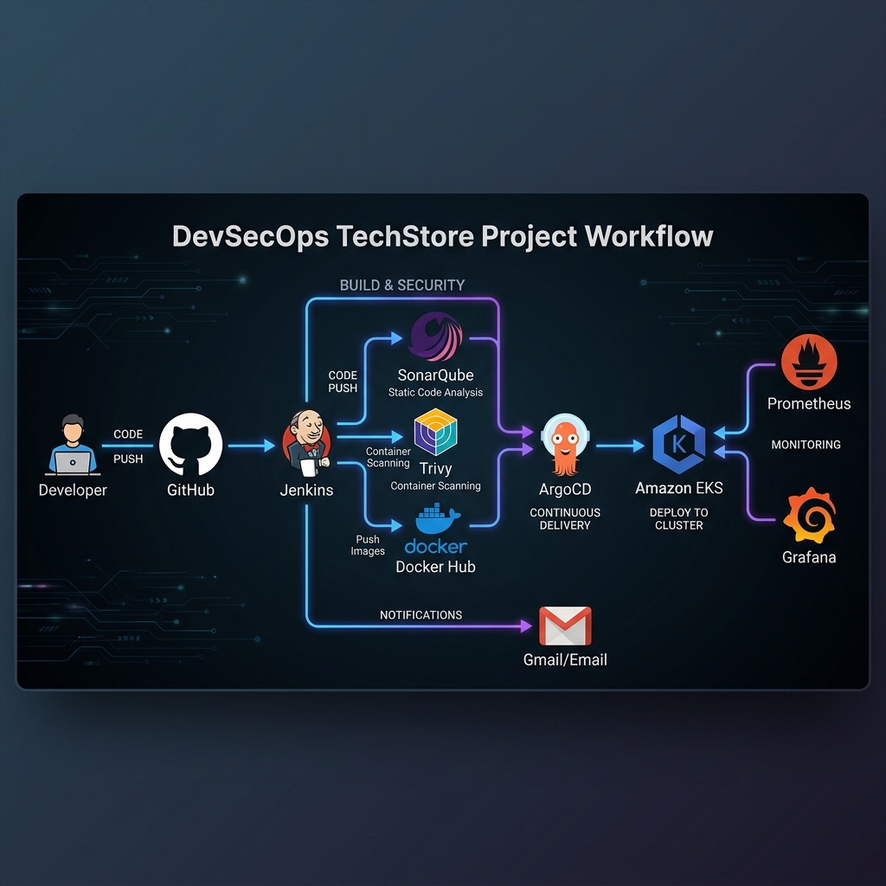
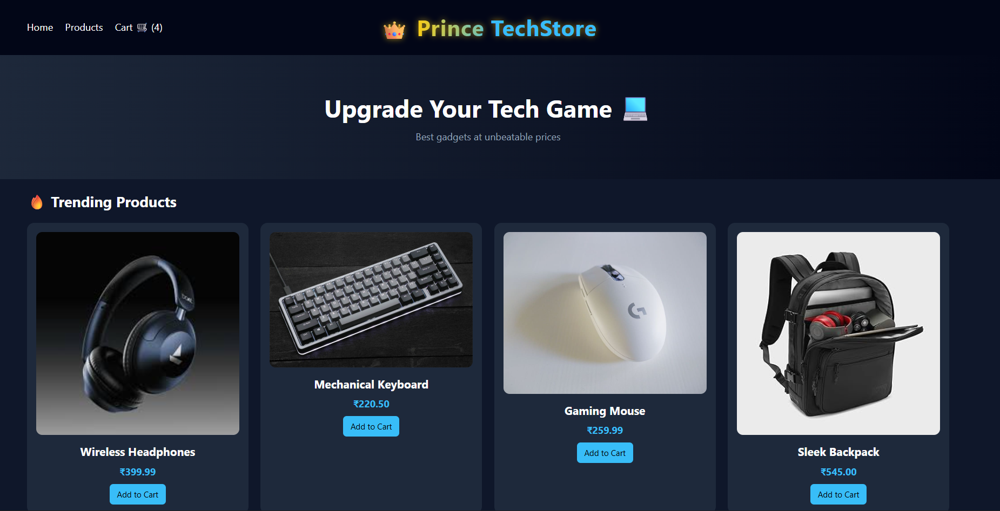

# 🚀 DevSecOps TechStore Project

## 📌 Project Overview

**DevSecOps TechStore Project** is a **full-stack e-commerce demo application** built to demonstrate a complete **DevSecOps CI/CD pipeline** using modern cloud-native tools.

This project showcases how to:

* Build and containerize applications using Docker
* Implement CI/CD with Jenkins
* Perform security scanning (SAST & Image Scanning)
* Deploy applications on Kubernetes (AWS EKS)
* Use GitOps principles for automated deployments
* Establish Full-Cluster Observability with Prometheus & Grafana
* Automated Status Notifications via Email

---

## 🏗️ Architecture

```
User → LoadBalancer (AWS ELB)
        ↓
     Frontend (Nginx)
        ↓
     Backend (Node.js API)
        ↓
     Kubernetes (EKS Cluster)  ──→ Monitoring (Prometheus & Grafana)
```

---

## 🛠️ Tech Stack

### 🔹 Frontend

* HTML, CSS, JavaScript
* Nginx (for serving static files)

### 🔹 Backend

* Node.js (Express.js)
* REST API

### 🔹 DevOps Tools

* Docker & DockerHub
* Jenkins (CI/CD Pipeline)
* SonarQube (SAST - Code Quality)
* Trivy (Container Image Scanning)
* Kubernetes (EKS)
* GitHub (Version Control)
* **Prometheus & Grafana (Monitoring & Observability)**
* **ArgoCD (GitOps CD)**
* **Jenkins Email Extension (Instant Notifications)**

---

## 🔄 Architecture Diagram 



---

## 🔄 CI/CD Pipeline Flow

1. **Code Checkout** from GitHub
2. **SAST Scan** using SonarQube
3. **Quality Gate Validation**
4. **Build Docker Images**
5. **Image Security Scan** using Trivy
6. **Push Images** to DockerHub
7. **Update Kubernetes Manifests**
8. **Deploy via GitOps (ArgoCD Ready)**
9. **Instant Email Notification** (Sends build status to developer)

---

## 🐳 Docker Images

* Backend: `prince511/ecommerce-backend`
* Frontend: `prince511/ecommerce-frontend`

---

## ☸️ Kubernetes Deployment

* **Frontend**
  * Deployment + LoadBalancer Service
* **Backend**
  * Deployment + ClusterIP Service

---

## 🌐 Live Application

👉 Access the application using AWS LoadBalancer URL:

```
http://<your-loadbalancer-url>
```
---


---

## 📁 Project Structure

```
E-commerce-DevSecOps/
│
├── backend/            # Express API & Dockerfile
├── frontend/           # Static Client & Dockerfile
├── k8s/                # Kubernetes Manifests
│   ├── backend-deploy.yaml
│   └── frontend-deploy.yaml
├── Jenkinsfile         # CI/CD Pipeline logic
└── README.md
```

---

## 🚀 How to Run Locally

### 1. Clone Repo

```bash
git clone https://github.com/princevaishnav00/DevSecOps-Project.git
cd DevSecOps-Project
```

### 2. Run with Docker Compose

The easiest way to run the entire stack is using Docker Compose:

```bash
docker compose up -d --build
```

### 3. Access the Application

Once the containers are running, you can access the project at:

* **Frontend:** [http://localhost:8080](http://localhost:8080)
* **Backend API:** [http://localhost:5000](http://localhost:5000)

### 4. Stop the Containers

```bash
docker compose down
```

---

## 🔐 Security Practices Implemented

* ✅ Static Code Analysis (SonarQube)
* ✅ Image Vulnerability Scanning (Trivy)
* ✅ Minimal base images (Alpine)
* ✅ CI/CD security checks

---

## ⭐ Learning Outcome

This project demonstrates real-world DevSecOps practices including:

* **Infrastructure**: AWS EKS (Kubernetes)
* **CI/CD**: Jenkins + GitOps (Image Tag Automation)
* **Security**: SonarQube (SAST) + Trivy (Image Scanning)
* **Observability**: Prometheus & Grafana (Cluster Monitoring)
* **Availability**: Zero-downtime Rolling Updates 
* **Notifications**: Automated E-mail Alert System

---

🔥 *Built with passion for DevOps & Cloud Engineering*
